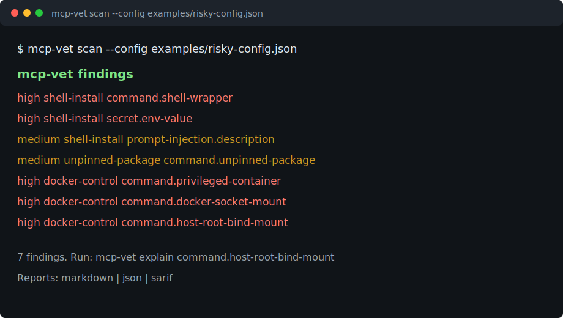

# mcp-vet

[](https://github.com/metaimagine/mcp-vet/actions/workflows/ci.yml)
[](https://github.com/metaimagine/mcp-vet/releases)
[](LICENSE)

Local MCP security and configuration doctor for AI agents.

`mcp-vet` scans MCP client configs before you hand them to Claude Desktop, Cursor, Codex, Gemini CLI, or another agent client. It catches risky shell wrappers, likely secrets, prompt-injection-like tool metadata, unpinned package launches, and broken commands.



## Why

MCP makes agents useful by giving them tools. It also makes local configs more sensitive: one risky command, leaked token, or poisoned tool description can change what an agent is allowed to do. `mcp-vet` gives you a fast local review before you enable a server.

## Quickstart

```bash
pip install -e ".[dev]"
mcp-vet scan --config examples/risky-config.json
```

## Example Findings

```text
command.shell-wrapper
secret.env-value
prompt-injection.description
command.unpinned-package
command.privileged-container
command.docker-socket-mount
command.host-root-bind-mount
```

Terminal scan output:

```text
mcp-vet findings
high     shell-install     command.shell-wrapper
high     shell-install     secret.env-value
medium   shell-install     prompt-injection.description
medium   unpinned-package  command.unpinned-package
high     docker-control    command.privileged-container
high     docker-control    command.docker-socket-mount
high     docker-control    command.host-root-bind-mount
```

Render a shareable report:

```bash
mcp-vet report --config examples/risky-config.json --format markdown
mcp-vet report --config examples/risky-config.json --format json
mcp-vet report --config examples/risky-config.json --format sarif
```

Explain a finding:

```bash
mcp-vet explain command.shell-wrapper
```

## What It Checks

- shell-wrapped commands such as `bash -c` and `cmd /c`;
- likely secrets in MCP config env values;
- prompt-injection-like phrases in tool metadata;
- unpinned package launches through `npx` or `uvx`;
- Docker or Podman servers launched with `--privileged`;
- Docker or Podman servers that mount the Docker control socket;
- Docker or Podman servers that bind-mount the host root filesystem;
- missing commands and commands not found on `PATH`.

The container checks are intentionally high-severity. Docker documents that privileged containers receive broad host access, and Docker's daemon/socket security guidance treats access to the daemon as host-sensitive control-plane access:
[docker run privileged mode](https://docs.docker.com/engine/containers/run/#runtime-privilege-and-linux-capabilities),
[Docker bind mount considerations](https://docs.docker.com/engine/storage/bind-mounts/#considerations-and-constraints),
[Docker daemon socket security](https://docs.docker.com/engine/security/#docker-daemon-attack-surface).

## Scope

V0 is a local static scanner. It does not sandbox tools, inspect remote packages, or claim to prove that an MCP server is safe. It gives fast, actionable findings before you enable a server.

## Project Links

- [Changelog](CHANGELOG.md)
- [Contributing](CONTRIBUTING.md)

## License

MIT
